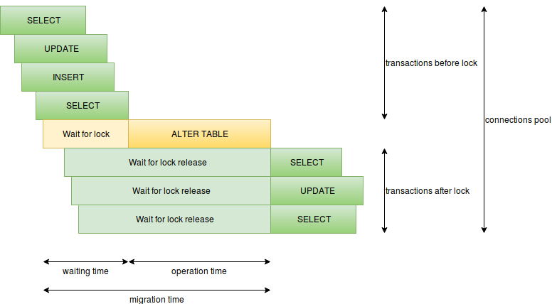

# django-pg-zero-downtime-migrations
Django postgresql backend that apply migrations with respect to database locks.

## Postgresql locks

Postgres has different lock levels that can conflict with each other https://www.postgresql.org/docs/current/static/explicit-locking.html:

|                          | `ACCESS SHARE` | `ROW SHARE` | `ROW EXCLUSIVE` | `SHARE UPDATE EXCLUSIVE` | `SHARE` | `SHARE ROW EXCLUSIVE` | `EXCLUSIVE` | `ACCESS EXCLUSIVE` |
|--------------------------|:--------------:|:-----------:|:---------------:|:------------------------:|:-------:|:---------------------:|:-----------:|:------------------:|
| `ACCESS SHARE`           |                |             |                 |                          |         |                       |             | X                  |
| `ROW SHARE`              |                |             |                 |                          |         |                       | X           | X                  |
| `ROW EXCLUSIVE`          |                |             |                 |                          | X       | X                     | X           | X                  |
| `SHARE UPDATE EXCLUSIVE` |                |             |                 | X                        | X       | X                     | X           | X                  |
| `SHARE`                  |                |             | X               | X                        |         | X                     | X           | X                  |
| `SHARE ROW EXCLUSIVE`    |                |             | X               | X                        | X       | X                     | X           | X                  |
| `EXCLUSIVE`              |                | X           | X               | X                        | X       | X                     | X           | X                  |
| `ACCESS EXCLUSIVE`       | X              | X           | X               | X                        | X       | X                     | X           | X                  |

## Migration and business logic locks

Lets split this lock to migration and business logic operations.

- Migration operations work synchronously in one thread and cover schema migrations (data migrations conflict with business logic operations same as business logic conflict concurrently).
- Business logic operations work concurrently.

### Migration locks

| lock                     | operations                                                                                                |
|--------------------------|-----------------------------------------------------------------------------------------------------------|
| `ACCESS EXCLUSIVE`       | `CREATE SEQUENCE`, `DROP SEQUENCE`, `CREATE TABLE`, `DROP TABLE` \*, `ALTER TABLE` \*\*, `DROP INDEX`     |
| `SHARE`                  | `CREATE INDEX`                                                                                            |
| `SHARE UPDATE EXCLUSIVE` | `CREATE INDEX CONCURRENTLY`, `DROP INDEX CONCURRENTLY` \*\*\*, `ALTER TABLE VALIDATE CONSTRAINT` \*\*\*\* |

\*: `CREATE SEQUENCE`, `DROP SEQUENCE`, `CREATE TABLE`, `DROP TABLE` shouldn't have conflicts, because your logic shouldn't operate with it

\*\*: Not all `ALTER TABLE` operations require `ACCESS EXCLUSIVE` lock, but all current django's migrations require it https://github.com/django/django/blob/master/django/db/backends/base/schema.py, https://github.com/django/django/blob/master/django/db/backends/postgresql/schema.py and https://www.postgresql.org/docs/current/static/sql-altertable.html

\*\*\*: Django currently doesn't support `CONCURRENTLY` operations

\*\*\*\*: Django doesn't have `VALIDATE CONSTRAINT` logic, but we will use it for some cases

### Business logic locks

| lock            | operations                   | conflict with lock                                              | conflict with operations                    |
|-----------------|------------------------------|-----------------------------------------------------------------|---------------------------------------------|
| `ACCESS SHARE`  | `SELECT`                     | `ACCESS EXCLUSIVE`                                              | `ALTER TABLE`, `DROP INDEX`                 |
| `ROW SHARE`     | `SELECT FOR UPDATE`          | `ACCESS EXCLUSIVE`, `EXCLUSIVE`                                 | `ALTER TABLE`, `DROP INDEX`                 |
| `ROW EXCLUSIVE` | `INSERT`, `UPDATE`, `DELETE` | `ACCESS EXCLUSIVE`, `EXCLUSIVE`, `SHARE ROW EXCLUSIVE`, `SHARE` | `ALTER TABLE`, `DROP INDEX`, `CREATE INDEX` |

So you can find that all django schema changes for exist table conflicts with business logic, but fortunately we can

## Operations FIFO waiting

Fond same diagram in interesting article http://pankrat.github.io/2015/django-migrations-without-downtimes/.

In this diagram we can extract several metrics:

1. operation time - time what you spend for schema change, so there are issue for long running operation on many rows tables like `CREATE INDEX` or `ALTER TABLE ADD COLUMN SET DEFAULT`, so you need use more save equivalents instead.
2. waiting time - your migration will wait until all transactions will be completed, so there are issue for long running operations/transactions like analytic, so you need avoid it or disable on migration time.
3. queries per second + execution time and connections pool - if you too many queries to table and this queries take long time then this queries can just take all available connections to database until wait for release lock, so look like you need different optimizations there: run migrations when load minimal, decrease queries count and execution time, split you data.
4. too many operations in one transaction - you have issues in all previous points for one operation so if you have many operations in one transaction then you have more chances to get this issues, so you should avoid many operations in one transactions (or event don't run it in transactions at all but you should be more careful when some operation will fail).